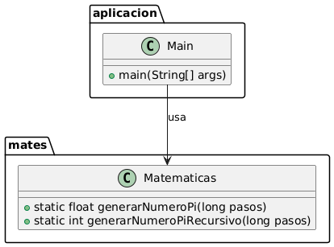

# Aproximacion-Pi-Recursividad

Este proyecto calcula el valor de PI utilizando el método de Monte Carlo. El programa lanza un número especificado de "dardos" aleatorios en un cuadrado y cuenta cuántos caen dentro de un círculo inscrito en ese cuadrado. La relación entre los dardos dentro del círculo y el total de dardos se utiliza para aproximar el valor de PI.

## Estructura del Proyecto

El proyecto consta de dos paquetes principales:

1. `aplicacion`: Contiene la clase `Main` que maneja la entrada del usuario y llama a los métodos para calcular PI.
2. `mates`: Contiene la clase `Matematicas` que implementa los métodos para calcular PI utilizando el método de Monte Carlo.

## Clases

### Main

La clase `Main` es la clase principal del programa. Se encarga de:
- Solicitar al usuario el número de dardos que desea lanzar.
- Llamar al método `generarNumeroPi` de la clase `Matematicas` para calcular el valor de PI.
- Mostrar el resultado al usuario.

### Matematicas

La clase `Matematicas` contiene los métodos necesarios para calcular el valor de PI. Sus responsabilidades incluyen:
- `generarNumeroPi`: Este método calcula el valor de PI utilizando el método de Monte Carlo. Llama al método recursivo `generarNumeroPiRecursivo` para contar cuántos dardos caen dentro del círculo.
- `generarNumeroPiRecursivo`: Este método recursivo lanza dardos aleatorios y cuenta cuántos caen dentro del círculo. Devuelve el número de aciertos.

## Cómo Ejecutar el Proyecto

1. Clona el repositorio en tu máquina local.
2. Navega al directorio del proyecto.
3. Compila las clases con el siguiente comando:
    ```sh
    javac aplicacion/Main.java mates/Matematicas.java
    ```
4. Ejecuta el programa con el siguiente comando:
    ```sh
    java aplicacion.Main
    ```
5. Ingresa el número de dardos que deseas lanzar y el programa calculará el valor de PI.

## Diagrama UML



## Descripción del Método de Montecarlo
El método de Montecarlo es una técnica de simulación que utiliza números aleatorios para aproximar resultados matemáticos. En este caso, se utiliza para calcular el valor de Pi generando puntos aleatorios dentro de un cuadrado y contando cuántos caen dentro de un círculo inscrito.

## Autor
Luis Holgado Arranz y Jesús Alejandro Hernández Méndez